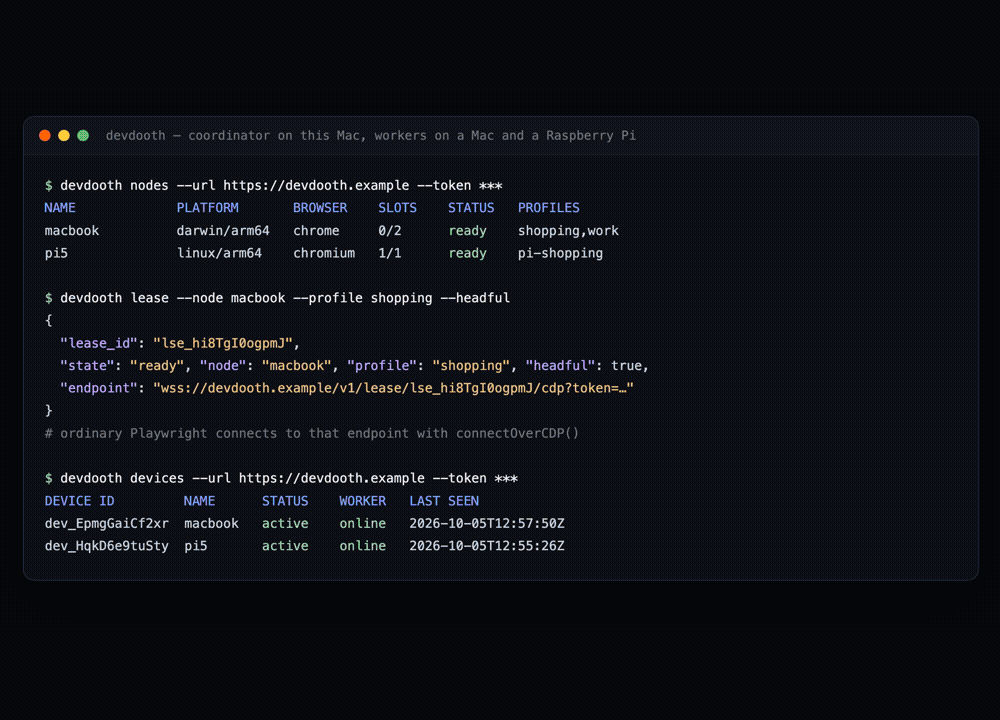
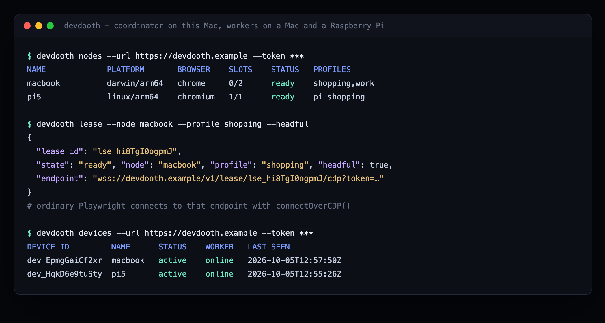
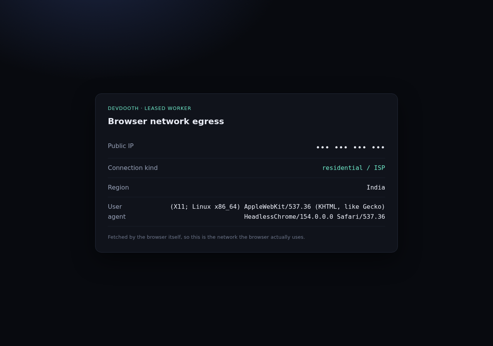
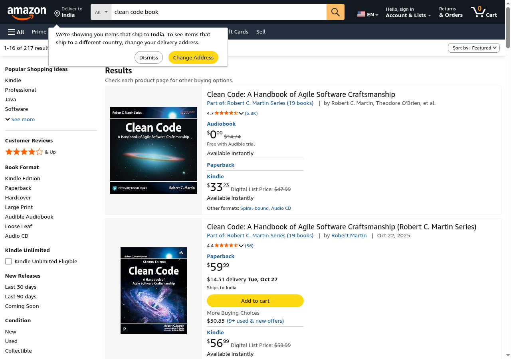
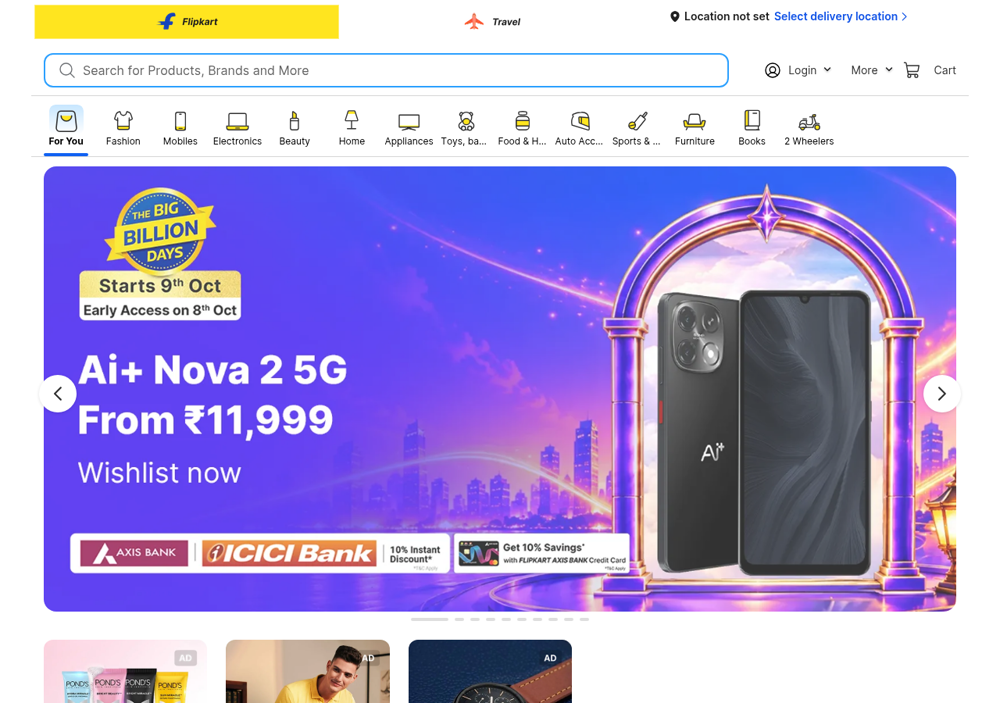
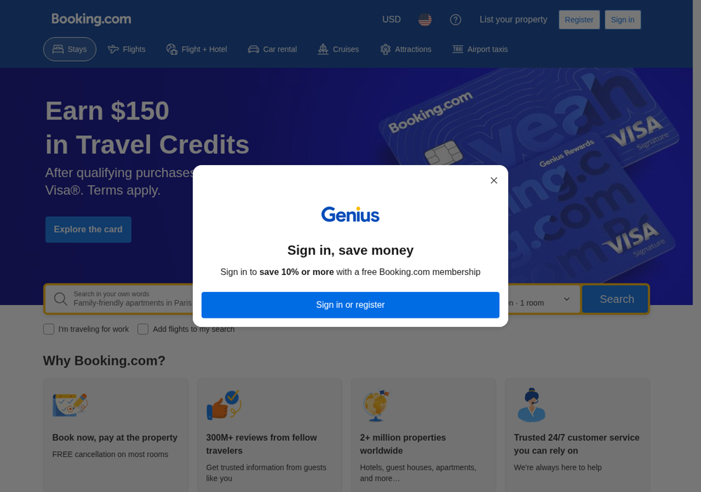
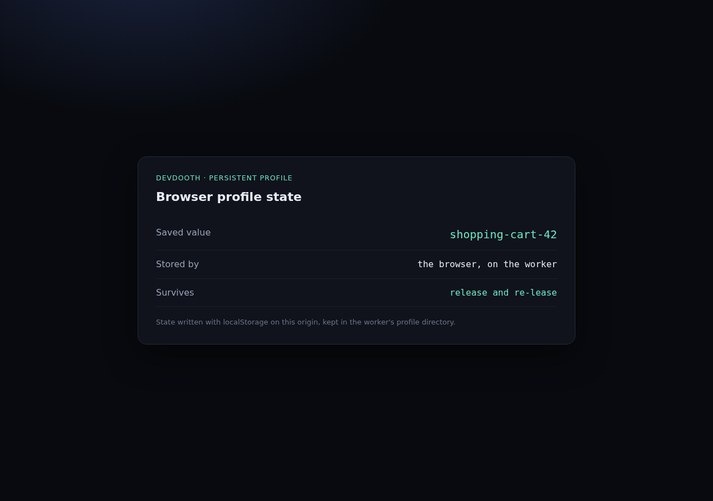

# Devdooth

[](https://github.com/unnipv/devdooth/actions/workflows/ci.yml)
[](LICENSE)

**Docs & landing page:** https://unnipv.github.io/devdooth/

**Devdooth turns machines you own into a browser pool for AI agents.**

Install a lightweight worker on a Mac, a Linux box, or a Raspberry Pi. Each worker
dials out to a coordinator — no inbound ports, no port forwarding. A caller
leases a browser and gets a standard CDP endpoint that ordinary Playwright,
Puppeteer, or any CDP client can drive.

```python
session = devdooth.lease(profile="shopping", headful=True)
browser = await playwright.chromium.connect_over_cdp(session.endpoint)
```

Devdooth is *browser infrastructure*, not a browser-automation product. It does
not understand webpages, selectors, prompts, or workflows. It seats a browser on
your hardware and hands you the endpoint.



*Real capture: coordinator on a Mac, workers on that Mac and on a Raspberry Pi 5.
The Pi has no inbound ports; the browser uses the Pi's own residential network.*

---

## Demos

Captured from real runs against a Raspberry Pi 5 worker (Chromium 154, headless)
and a Mac worker (Chrome 154), driven by ordinary Playwright over CDP.



The browser's real network (a residential ISP, not a datacenter range) and a real
search run on the Pi:

| | |
|---|---|
|  |  |

Marketplaces and travel, loaded from the Pi's own connection:

| | |
|---|---|
|  |  |



One profile, two leases, a brand-new browser each time:

| | |
|---|---|
|  |  |

Sites that aggressively challenge automation are left alone. Devdooth is not an
anti-bot or CAPTCHA-bypass product; it uses the network and profile of the
machine you chose.

---

## What it is

- **Outbound-only workers.** Your laptop and Pi never listen for inbound
  connections, so NAT and firewalls stay as they are.
- **Standard endpoints.** A leased browser speaks CDP, so existing automation
  and agents work without a proprietary action language.
- **Profiles stay on your machine.** Named profiles persist on the worker; the
  coordinator stores only metadata.
- **One coordinator, many machines.** Capability matching (node, browser,
  profile, headful) plus simple least-loaded scheduling.

## What it is not

- Not an anti-bot, CAPTCHA, stealth, or fingerprint-evasion product.
- Not a crawler, scraper, dataset, or workflow-recording platform.
- Not a browser-agent implementation. It composes with existing ones.
- Not multi-tenant. V1 trusts one owner and that owner's automation clients.

---

## How it works

```
   agent / Playwright                    Devdooth coordinator
        │                                      │
        │  lease API (HTTP)                    │  node registry, leases,
        ├─────────────────────────────────────▶│  scheduling, auth
        │                                      │
        │  CDP over WebSocket                  │
        ├─────────────────────────────────────▶│◀──── outbound control ────┐
        │                                      │      WebSocket            │
        │                                      │                           │
        │                                      │◀── outbound data tunnel ──┤
        │                                      │      (one per attachment) │
        └──────────────────────────────────────┘                           │
                                                                           │
                                                            ┌──────────────┴──────────────┐
                                                            │  worker (Mac / Pi / Linux)  │
                                                            │  ├─ launches Chrome         │
                                                            │  ├─ debug port on loopback  │
                                                            │  ├─ local persistent profile│
                                                            │  └─ relays CDP, unparsed    │
                                                            └─────────────────────────────┘
```

The coordinator relays bytes. It never parses CDP messages.

---

## Install

One binary contains the coordinator, the worker, and the CLI.

**Install script (macOS/Linux):**

```bash
curl -fsSL https://raw.githubusercontent.com/unnipv/devdooth/main/scripts/install.sh | sh
devdooth version
```

**From source:**

```bash
go install github.com/unnipv/devdooth/cmd/devdooth@latest
```

**Release binaries:** see
[Releases](https://github.com/unnipv/devdooth/releases) for archives with
SHA-256 checksums (macOS arm64/amd64, Linux amd64/arm64, Windows amd64).

**Docker (coordinator):**

```bash
docker run -p 8080:8080 -v devdooth:/data ghcr.io/unnipv/devdooth:latest
```

Images are published to GitHub Container Registry on release. If `docker pull`
is denied on the first release, the package visibility needs to be set to public
once in the repository's package settings.

Workers normally run on the host beside their browser so the browser uses that
machine's network and profile.

## Quickstart

Build the binary locally if you prefer:

```bash
go build -o bin/devdooth ./cmd/devdooth
```

### 1. Start the coordinator

Pick a machine with a stable address. For local development:

```bash
bin/devdooth coordinator --addr :8080
# prints a generated admin token and worker token; or pass your own:
#   --admin-token <t> --worker-token <t>
```

### 2. Enroll and join a machine that should lend its browser

Mint a single-use enrollment token on the coordinator host:

```bash
bin/devdooth enroll-token --url http://localhost:8080 --token <admin-token> --label macbook
# prints the token once
```

On each Mac / Linux / Pi:

```bash
bin/devdooth join --coordinator http://192.168.1.10:8080 \
  --enroll-token <enrollment-token> \
  --name macbook

bin/devdooth worker --coordinator http://192.168.1.10:8080 \
  --profiles shopping,work
```

The device identity is stored under `~/.devdooth/device.json`, so restarting
the worker needs no token. The coordinator stores only a hash of the device
token. `devdooth devices` lists enrolled devices; `devdooth devices revoke --id
<id>` disables one and disconnects it immediately.

(The legacy `--token` static worker token still works for local development.)

```bash
bin/devdooth nodes --url http://192.168.1.10:8080 --token <admin-token>
```

```
NAME             PLATFORM       BROWSER    SLOTS    STATUS   PROFILES
macbook          darwin/arm64   chrome     0/1      ready    shopping,work
bedroom-pi       linux/arm64    chromium   0/1      ready    clean
```

### 3. Lease a browser

```bash
bin/devdooth lease --url http://192.168.1.10:8080 --token <admin-token> \
  --profile shopping --headful --ttl 1800
```

```json
{
  "lease_id": "lse_Yl1xhlum9Yst",
  "state": "ready",
  "node": "macbook",
  "endpoint": "ws://192.168.1.10:8080/v1/lease/lse_Yl1xhlum9Yst/cdp?token=...",
  "expires": "2026-10-05T10:09:34Z"
}
```

### 4. Drive it with Playwright

```python
from playwright.async_api import async_playwright

async with async_playwright() as p:
    browser = await p.chromium.connect_over_cdp(session.endpoint)
    context = browser.contexts[0]
    page = context.pages[0]
    await page.goto("https://example.com")
```

Release when done:

```bash
bin/devdooth release --url http://192.168.1.10:8080 --token <admin-token> --lease <lease-id>
```

The lease also expires on its own, enforced by the worker even if the
coordinator goes away.

---

## Use it from an AI agent

Devdooth does not implement browser tools. It leases a browser and hands it to
an existing agent loop.

### Playwright MCP

`devdooth mcp` acquires a lease, starts
[Playwright MCP](https://github.com/microsoft/playwright-mcp) pointed at that
browser, and releases the lease when the server exits. It speaks MCP over
stdio, so any MCP client (Claude Code, Cursor, VS Code, …) can use it:

```bash
bin/devdooth mcp \
  --url http://192.168.1.10:8080 \
  --token <admin-token> \
  --node macbook \
  --profile shopping \
  --headful
```

MCP client config:

```json
{
  "mcpServers": {
    "devdooth": {
      "command": "/absolute/path/to/bin/devdooth",
      "args": ["mcp", "--url", "http://192.168.1.10:8080", "--token", "<admin-token>",
               "--node", "macbook", "--profile", "shopping", "--headful"]
    }
  }
}
```

Then ask the agent: *"Go to the site, find X, and report back."* The browser it
drives is running on your Mac, using your profile's login state.

### Let a coding agent set it up

Point your coding agent at [AGENTS.md](AGENTS.md). It contains a copy-paste task
that builds Devdooth, starts a coordinator and a worker, leases a browser, and
verifies the page — no other instructions needed.

### Browser Use / Stagehand / anything CDP

Point the library at the lease endpoint:

```python
from browser_use import Browser
browser = Browser(cdp_url=session.endpoint)
```

---

## Profiles

Profiles keep cookies and logins on the worker machine, across leases.

```bash
bin/devdooth worker --coordinator ... --token ... --profiles shopping,work
```

- A profile maps to `<data-dir>/profiles/<name>` (default `~/.devdooth`). The
  location is overridden with `--data-dir`.
- One profile is used by at most one browser at a time. A second request fails
  explicitly rather than corrupting state.
- Profile data stays on its worker and is never copied between machines. A
  profile-only request matches any online worker advertising that name; pass
  `--node` with `--profile` to pin a specific machine's profile.

Type a password or complete MFA once in headful mode, and later leases reuse it.

## Human take-over

For a headful lease, a person can take over the visible browser:

```bash
devdooth pause --url ... --token ... --lease <id>   # agent is detached
# use the Chrome window on the worker machine
devdooth resume --url ... --token ... --lease <id>  # agent may attach again
```

`pause` closes the controller's CDP connection and rejects new controllers while
paused; the browser keeps running, so the human works in the real window.
`resume` allows the agent to attach again.

Honest semantics: this is cooperative hand-over. It does not stop a command the
agent had already sent, and the agent must reconnect after resume. It is meant
for "the page needs a human now", not for enforcing ownership against a
malicious client.

---

## CLI

```
devdooth coordinator   [--addr :8080] [--store devdooth.db] [--admin-token T] [--worker-token T]
devdooth join          --coordinator URL --enroll-token T [--name N] [--data-dir DIR]
devdooth enroll-token  --url URL --token ADMIN [--label L] [--ttl SECONDS]
devdooth devices       --url URL --token ADMIN
devdooth devices revoke --url URL --token ADMIN --id DEVICE_ID
devdooth worker        --coordinator URL [--enroll-token T | --token T] [--name N]
                       [--data-dir DIR] [--max-slots N] [--headful] [--browser chrome]
                       [--profiles a,b] [--no-sandbox]
devdooth nodes         --url URL --token ADMIN
devdooth lease         --url URL --token ADMIN [--node N] [--profile P] [--browser B]
                       [--headful] [--ttl SECONDS] [--start-url URL]
devdooth release       --url URL --token ADMIN --lease ID
devdooth pause         --url URL --token ADMIN --lease ID
devdooth resume        --url URL --token ADMIN --lease ID
devdooth mcp           --url URL --token ADMIN [--node N] [--profile P] [--headful]
                       [--mcp "npx -y @playwright/mcp@0.0.83"] [-- extra args]
```

## HTTP API

| Method | Path | Purpose |
|---|---|---|
| `GET` | `/healthz` | liveness |
| `GET` | `/v1/nodes` | list connected workers and capabilities |
| `POST` | `/v1/leases` | acquire a browser |
| `GET` | `/v1/leases/{id}` | lease state |
| `DELETE` | `/v1/leases/{id}` | release (waits for teardown) |
| `GET` | `/v1/lease/{id}/cdp?token=` | CDP WebSocket endpoint |
| `POST` | `/v1/enroll-tokens` | mint a single-use enrollment token |
| `POST` | `/v1/enroll` | redeem an enrollment token for a device identity |
| `GET` | `/v1/devices` | list enrolled devices |
| `DELETE` | `/v1/devices/{id}` | revoke a device and disconnect it |
| `GET` | `/v1/worker/connect` | worker control channel (workers only) |
| `GET` | `/v1/tunnel/{id}` | worker data tunnel (workers only) |

---

## Security model

A leased browser may be logged into your email, bank, or internal services.
Treat raw browser access as a powerful capability.

V1 assumes a **trusted owner, trusted automation clients, and a trusted
coordinator**. Arbitrary websites remain untrusted.

What Devdooth does:

- Workers connect outbound only; the browser's debug port binds to loopback.
- Separate admin and worker tokens, compared in constant time.
- Per-lease session credentials, scoped to a single lease and its TTL.
- Bounded message sizes; a stalled peer is disconnected instead of buffered
  without limit.
- The relay never logs CDP payloads. Normal lifecycle logs omit credentials;
  development startup and credential-recovery paths deliberately print a token
  so it is not lost.
- The worker enforces the lease TTL itself.

> **Running in a container or a locked-down CI runner?** Chrome's sandbox needs
> unprivileged user namespaces. If the browser exits immediately, start the
> worker with `--no-sandbox` and run it as a non-root user where possible.

What it does not do (by design):

- It does not protect you from a compromised coordinator: that coordinator can
  drive any profile the worker exposes.
- It cannot make an authorized CDP client safe. A CDP client can read local
  files and reach local-network services within the browser's privileges.
- CDP command filtering is **not** a security boundary.

For real isolation, run workers under a separate OS account, container, or VM,
and only expose profiles you are willing to lend.

Run non-local deployments behind TLS (terminate `wss://` at a reverse proxy).
`--public-url` accepts either an http(s) or ws(s) URL and is normalised to a
WebSocket scheme for lease endpoints.

## Development

```bash
make test        # unit + lifecycle tests
make race        # race detector
make e2e         # real Chromium through the relay (needs Chrome)
make smoke       # coordinator + worker + Playwright, end to end
```

`scripts/browse.mjs` is a small Playwright CLI for driving a lease one action
at a time (goto, click, fill, eval, screenshot, …). It is handy for manual
checks and as the tool surface for an LLM agent loop.

See [docs/architecture.md](docs/architecture.md) for the design,
[docs/deployment.md](docs/deployment.md) for production setup, and
[docs/threat-model.md](docs/threat-model.md) for the security model.

## Why Devdooth?

Writ, Selenium Grid, Browserless, and BrowserThing already move browser work off
your laptop. Devdooth differs in where the seam is:

- **Writ** is a browser-automation platform. Devdooth exposes the browser
  itself and lets other systems drive it.
- **Selenium Grid / Browserless / BrowserThing** are browser *servers*. They run
  browsers on infrastructure you operate directly, usually expecting
  coordinator-to-node reachability. Devdooth is about enrolling personal
  machines you already own behind NAT, with local profiles, over outbound-only
  connections.

If you already have a reachable browser server that works for you, use it.
Devdooth exists for the case where the browser you want lives on your own
laptop, in your own account, behind your own router.

## License

Apache-2.0. See [LICENSE](LICENSE).
